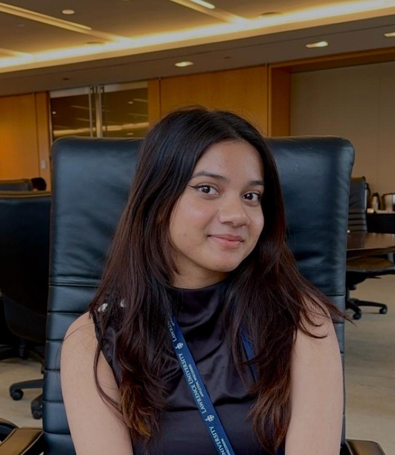

```{=html}
<div class="home-container">
  <div class="left-col">
    
    <div class="social-links">
      <a href="mailto:tahana.akram@lawrence.edu" title="Email">
        <i class="bi bi-envelope-fill"></i>
      </a>
      <a href="https://www.linkedin.com/in/tahanaakram/" target="_blank" title="LinkedIn">
        <i class="bi bi-linkedin"></i>
      </a>
      <a href="https://github.com/akramt24" target="_blank" title="GitHub">
        <i class="bi bi-github"></i>
      </a>
    </div>
  </div>
  <div class="right-col">
```

<h1 class="my-name">Tahana Akram</h1>
<p class="my-tagline">Business Analytics & Data Science Student</p>

<div class="info-block">
  <p>🎓 <strong>Bachelor of Arts</strong> — Lawrence University, Appleton, WI (Expected June 2027)</p>
  <p>📚 <strong>Majors:</strong> Business & Entrepreneurship, Business Analytics</p>
  <p>📖 <strong>Minor:</strong> Data Science</p>
  <p>💡 <strong>Interdisciplinary Area:</strong> Innovation and Entrepreneurship</p>
</div>

## Work Experience

**Supply Chain & Transportation Intern** — Schreiber Foods | *Green Bay, WI | April 2026–Present*

- Created and validated operational reports for daily and weekly transportation activities, ensuring data accuracy across industry-leading Transportation Management Systems (TMS)
- Tracked and reconciled inbound and outbound shipments between plants and distribution centers, flagging delays and coordinating resolutions with carriers in real time
- Responded to carrier requests and published dashboard reports to internal stakeholders, streamlining communication and improving visibility into supply chain performance
- Gained hands-on exposure to end-to-end transportation planning, facilitating the movement of internal product between Schreiber's plants and distribution centers

---

**Business Analyst Intern** — Youbloom | *Remote | Sept 2025–Dec 2025*

- Conducted competitive research on 3–4 industry event pages, identifying UX, pricing, and content gaps to improve customer engagement
- Supported system documentation, troubleshooting, and reporting templates across web-based platforms
- Assisted in User Acceptance Testing (UAT) and Quality Assurance (QA), reviewing workflows before deployment
- Collaborated cross-functionally with e-commerce, marketing, and CX teams to optimize digital workflows

---

**Intern** — BRAC | *Dhaka, Bangladesh | Sept–Nov 2025*

- Produced a market linkage report after surveying 20+ farmers, traders, and wholesalers, conducting supply chain mapping and vendor relations analysis
- Developed a Safe Food Model by evaluating 10+ markets, identifying operational gaps, and creating strategic recommendations
- Utilized Excel to track inventory and streamline logistics processes applicable to ERP/MRP environments
- Collaborated with finance and logistics teams to optimize product flow and ensure cost-efficiency

---

## Biography

I'm Tahana Akram, a Business Analytics and Data Science student at Lawrence University in Appleton, WI, with a passion for business research, market strategy, and finding the story behind the numbers. Whether it's analyzing competitive landscapes for a global music platform, optimizing digital workflows for an e-commerce team, or tracking supply chain performance at one of the largest dairy companies in the world, I'm drawn to work that sits at the intersection of strategy, research, and real-world impact.

Through internships at YouBloom, BRAC, and Schreiber Foods, I've built hands-on experience in competitive research, market analysis, operational reporting, and supply chain coordination — always with an eye toward what the data means for the business, not just what it says. In the classroom, I've developed frameworks for consumer behavior, brand positioning, and market sizing through projects for companies like Stanley and Fenty Beauty. Beyond academics, I serve as an accounting tutor and Data Science Club member, roles that keep me sharp, collaborative, and connected to my community.

Outside of work and school, you'll find me painting — I love experimenting with color and using canvas as a way to slow down and think visually. I also enjoy cooking and trying to recreate dishes from different cuisines, which honestly isn't so different from research: you follow a process, make adjustments along the way, and hope the final result comes together.

---

## Get in Touch

- 📧 **Email:** [tahana.akram@lawrence.edu](mailto:tahana.akram@lawrence.edu)
- 📞 **Phone:** 920-558-0603
- 💼 **LinkedIn:** [linkedin.com/in/tahanaakram](https://www.linkedin.com/in/tahanaakram/)
- 🐙 **GitHub:** [github.com/akramt24](https://github.com/akramt24)

```{=html}
  </div>
</div>
```