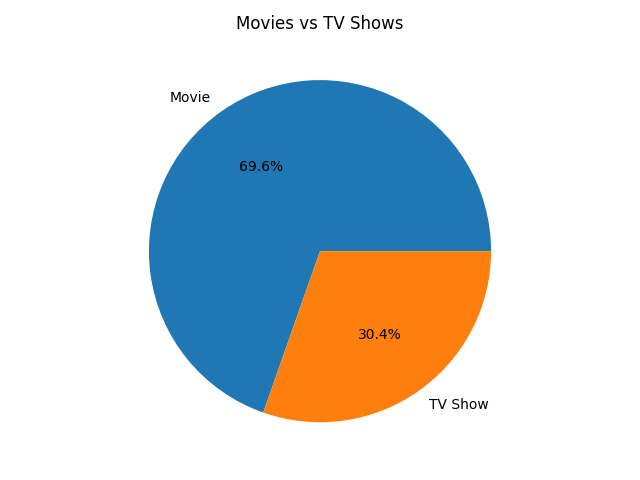
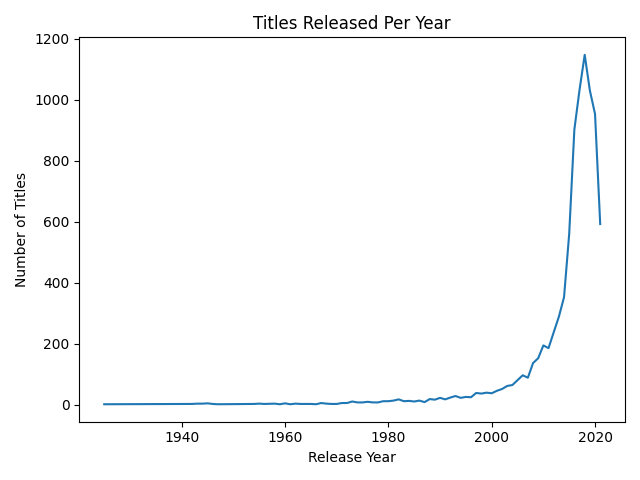
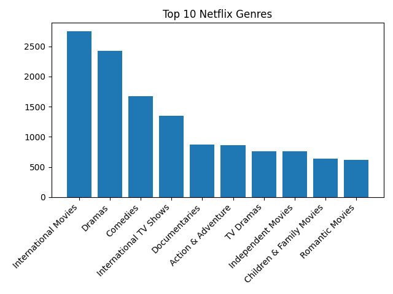
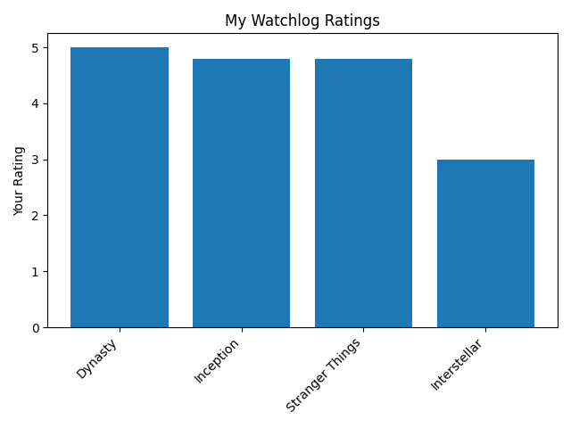

This project analyzed Netflix's full content library alongside a personal watch log to explore how the platform's catalog has evolved over time. Using Python and pandas, the analysis examined content type distribution, genre trends, release year patterns, and personal ratings.

{width=80%}

{width=80%}

{width=80%}

{width=80%}

